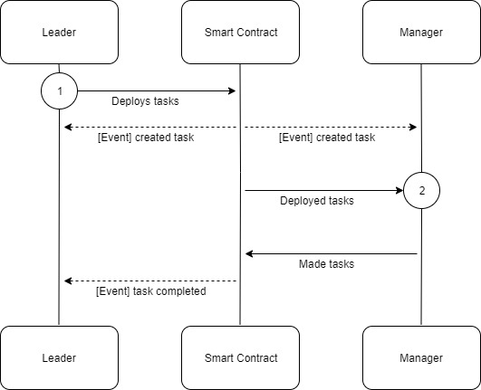
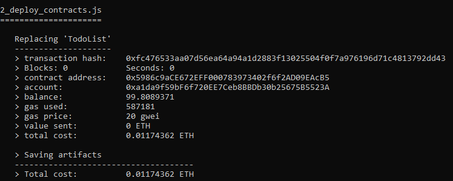
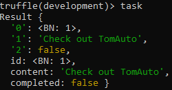

# VU-blochchain-4
4-th task of VU blockchain course

## Užduotis
Pagrindinis šios užduoties tikslas yra sukurti išmaniąją sutartį (angl. smart contract), kuri įgyvendintų tam tikrą verslo logiką ir galėtų užtikrinti jos "saugų" ir "patikimą" funkcionavimą decentralizuotame viešąjame tinkle. Išmaniosios sutarties valdymui ir verslo proceso dalyvių tarpusavio sąveikai palengvinti bus kuriama decentralizuota aplikacija su Front-End.
Šioje užduotyje išmanioji sutartis įgyvendinama Solidyti programavimo kalba ir turi būti adaptuota Ethereum blockchain tinklui.

## Apie darbą
Parašytas gan paprastas smart kontraktas, kuris užtikrina, kad galima būtų pridėti užduotį į užduočių sarašą. Taip pat smart kontraktas leidžia uždduotį pažymėti kaip atliktą.
Naudotojo interfeisui sukurti naudota js programavimo kalba, kuri kontaktuoja su smart kontraktu kaip ir valdo visą interfeisą. Stiliui kurti naudota bootstrap frameworkai.

## Srauto diagrama:

## Kontrakto paleidimas:

## Sąrašas konsolėje:
